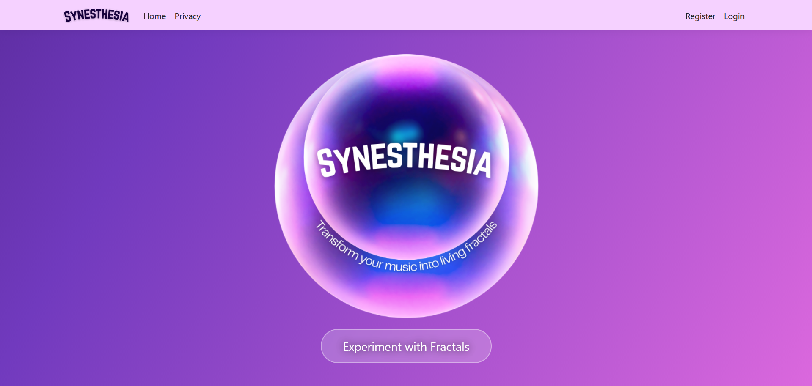
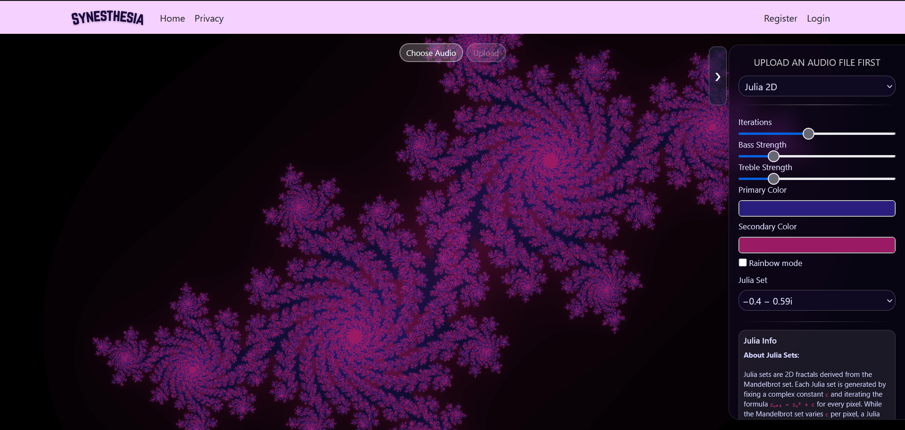
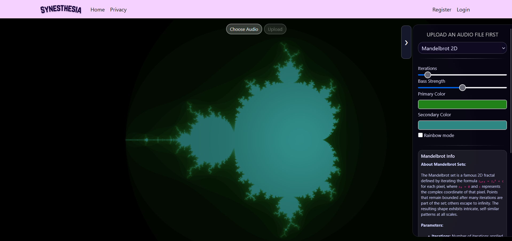
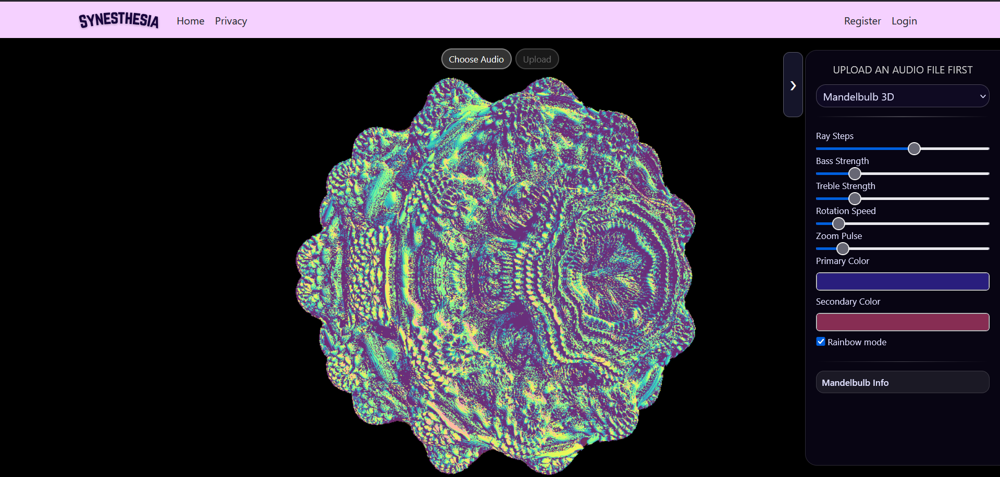

# Synesthesia – Audio-Reactive Fractal Visualizer

**Synesthesia** is a web-based audio-visual platform that generates real-time **2D and 3D fractal visualizations** synchronized with music.  
The application analyzes audio signals using **FFT** in the browser and maps frequency data (bass, treble, peaks) to visual parameters such as zoom, rotation, color, and pulsation.

## Main Features

### Audio Visualization
- Upload audio files (**MP3 / WAV**)
- Real-time FFT analysis using **Web Audio API**
- Extraction of bass, treble, peaks
- Synchronization between audio frequencies and fractal animation

### Fractal Rendering (WebGL + GLSL)
- **Julia Set (2D)**

- **Mandelbrot (2D)**

- **Mandelbulb (3D)** using ray marching and distance estimation

  
- GPU-accelerated rendering via **Three.js**

### Interactive Control Menu
- Change fractal type dynamically
- Real-time sliders for:
  - Iterations
  - Zoom
  - Rotation speed
  - Bass & treble influence
- Color customization:
  - Primary & secondary color
  - Rainbow (HSV-based) mode
- Pause / resume visualization

### Saving & Persistence
- **Local saving**
  - Export visualization as video (canvas + audio)
- **User profile saving**
  - Save visualization instances (parameters + metadata)
  - Reload and replay saved visualizations

## Technologies Used

- **Backend:** ASP.NET Core (C#)
- **Frontend:** Razor Pages + JavaScript (WebGL integration)
- **Graphics:** WebGL + GLSL shaders (fractal rendering, ray marching, distance estimation)
- **WebGL Framework:** Three.js
- **Audio Processing:** Web Audio API (FFT, peak detection, bass/treble analysis, audio–visual synchronization)
- **Database:** SQL Server
- **Authentication:** ASP.NET Identity
- **Version Control:** GitHub
- **Testing:** xUnit, Coverlet (C#), Playwright (JavaScript)

## Project Management & Methodology

### Development Methodology
- **Agile / Scrum**
- Backlog-driven development
- Incremental feature delivery

### Artifacts
- Product Backlog
- User Stories (INVEST-compliant)
- Story Point Estimation (Planning Poker)
- UML Diagrams
- Database Diagram
- Gantt Diagram
- Use Case Diagram

## Testing & Validation

### Testing Strategy
- **Unit testing**
  - Backend logic (C# – xUnit)
- **Integration testing**
  - Authentication
  - Data persistence
- **Frontend testing**
  - JavaScript behavior
  - UI interaction flows (Playwright)

### Performance Testing
- WebGL rendering ≥ **30 FPS**
- Audio upload response time < **2 seconds**
- Stress-tested with high FFT sizes and high iteration fractals

### Validation
- Manual testing of:
  - Real-time audio synchronization
  - Menu responsiveness
  - Fractal switching without memory leaks
- Cross-browser testing (Chrome, Edge, Firefox)
